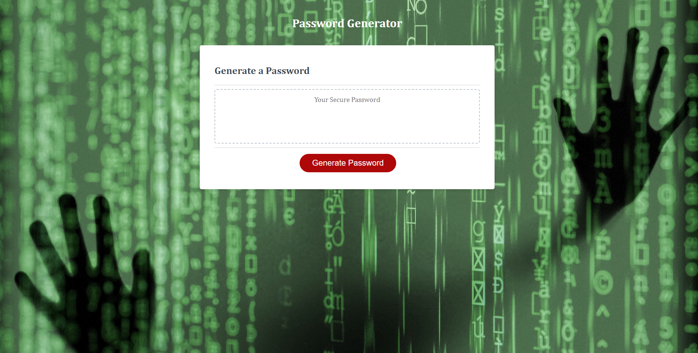

# Unit 5 Challenge: Password Generator

## Description

This challeneg requires me to create a password generator. The generator shall include user prompts to choose wich sort of characters are to be included in the password

This criteria was as follows;

* Generate a password when the button is clicked

* Present a series of prompts for password criteria

* Once all criteria has been selected the password shall be generated and displayed

### Link to work

https://tomking1983.github.io/bootcamp-password-generator/

### Screenshot of website

